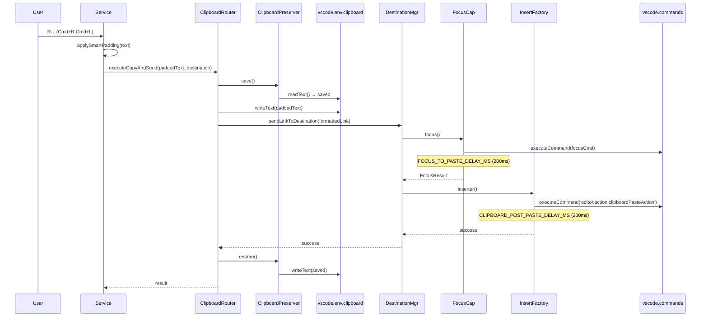

# ADR-0003: Single Clipboard Write per Operation

- **Status:** Accepted
- **Date:** 2026-05-11
- **Deciders:** @couimet

## Context

RangeLink operations (R-L, R-V, R-F) involve writing link text to the clipboard and then pasting it at the destination (terminal, AI assistant panel, text editor). Before this refactoring, two separate `ClipboardPreserver` wrappers ran per operation — an outer one in `ClipboardRouter.executeCopyAndSend()` and an inner one inside the individual `InsertFactory.forTarget()` implementations. This caused:

- **Double clipboard writes.** Both `ClipboardRouter` and the insert factory wrote text to the clipboard. The second write could race with VS Code's paste command in webview-based destinations, where the paste reads from clipboard asynchronously across an Electron IPC boundary.
- **Nested ClipboardPreservers.** Each `ClipboardPreserver` called `vscode.env.clipboard.writeText()` to save and restore the user's prior clipboard. Two nestings meant four clipboard API calls per operation (save + write + restore + save + write + restore).
- **Double padding.** `applySmartPadding()` ran in both `PasteDestinationManager.performPaste()` and the individual call sites, making it impossible to reason about whether a given code path had padding applied once, twice, or not at all.
- **Multi-command paste fallback.** `ManualPasteInsertFactory.forTarget()` tried multiple paste commands (`editor.action.clipboardPasteAction`, `cursorAi.paste`, etc.) in sequence. The fallback logic was only needed because the clipboard write and paste command could desynchronize under the nested-preserver model.
- **Custom AI assistant paste commands in Tier 2.** `focusAndPasteCommands` included both focus AND paste command arrays, but the paste commands (`editor.action.clipboardPasteAction`) were always the same for built-in assistants. The differentiating factor was whether the destination used auto-paste or manual paste — not which paste commands to try.

The refactoring gives `ClipboardRouter` sole ownership of the clipboard write. `InsertFactory` implementations only execute paste commands (never write to clipboard). This eliminates every problem above: single write, single preserve, single padding, single paste command.

## Decision

### 1. ClipboardRouter owns the sole clipboard write

`ClipboardRouter.executeCopyAndSend()` performs one `vscode.env.clipboard.writeText()` wrapped in a single `ClipboardPreserver`. The text is pre-padded by the caller. After the clipboard write succeeds, the router delegates to `PasteDestinationManager.sendLinkToDestination()` which focuses the destination and calls the insert factory — no clipboard access at all.

### 2. Insert factories execute paste, never write clipboard

| Factory                    | Before                                                      | After                                                  |
| -------------------------- | ----------------------------------------------------------- | ------------------------------------------------------ |
| `AIAssistantInsertFactory` | Wrote clipboard, executed paste commands                    | Calls `pasteTextFromClipboard()` only                  |
| `TerminalInsertFactory`    | Wrote clipboard, called `pasteIntoTerminal(terminal, text)` | Calls `pasteIntoTerminal(terminal)` only               |
| `EditorInsertFactory`      | Called `insertTextAtCursor(editor, text)`                   | Unchanged (editor insert is direct, not via clipboard) |

`_text` is accepted but ignored by AI assistant and terminal insert factories since the text is already on the clipboard.

### 3. Two-delay model

```text
┌────────────┐     ┌──────────────┐     ┌─────────────────┐
│ Focus cmd  │────▶│ FOCUS_DELAY  │────▶│ Clipboard Paste │
│ executed   │     │ (pre-paste)  │     │ Command         │
└────────────┘     └──────────────┘     └────────┬────────┘
                                                 │
                                    ┌────────────▼────────────┐
                                    │ CLIPBOARD_POST_PASTE    │
                                    │ _DELAY (post-paste)     │
                                    └─────────────────────────┘
```

- **Pre-paste (`FOCUS_TO_PASTE_DELAY_MS = 200`):** Applied in `AIAssistantFocusCapability.focus()` after a successful focus command executes, giving the target panel time to load its webview and become ready for clipboard paste. Only applies when focus actually runs — skipped on "warm" sends where the panel is already visible.
- **Post-paste (`CLIPBOARD_POST_PASTE_DELAY_MS = 200`):** Applied inside `VscodeAdapter.pasteTextFromClipboard()` after `editor.action.clipboardPasteAction` succeeds. Gives webview-based assistants (Claude Code, Copilot Chat) time to read from the async clipboard across the Electron IPC boundary before the outer `ClipboardPreserver` restores the user's prior clipboard.

### 4. Padding pre-applied at call sites

Four call sites apply `applySmartPadding()` to both `content.clipboard` and `content.send` before passing to `ClipboardRouter.executeCopyAndSend()`: `LinkGenerator`, `TextSelectionPaster`, `FilePathPaster`, `TerminalSelectionService`. `PasteDestinationManager.performPaste()` is removed entirely — padding is a presentation concern, not a paste concern.

### 5. `focusAndPasteCommands` renamed to `focusCommands`

The `BuiltinAiAssistantDef` type uses `focusCommands` instead of `focusAndPasteCommands` to reflect that paste commands are no longer configurable per assistant. The paste command is always `editor.action.clipboardPasteAction`. The user-facing `CustomAiAssistantConfig.focusAndPasteCommands` is preserved for backward compatibility — it maps to the same behavior but under the simplified internal interface.

### 6. Sequence diagram



**Confidence:**

- Single clipboard write: HIGH — validated with full integration test suite
- Two-delay model: MEDIUM — delay values (200ms) are empirical, tuned against VS Code on macOS; may need adjustment for other platforms or slower machines
- Padding pre-application: HIGH — verified at all 4 call sites via unit tests
- Tier 2 rename: HIGH — backward-compatible with `CustomAiAssistantConfig.focusAndPasteCommands` preserved

## Alternatives Considered

- **Add `marginMs` to `ClipboardPreserver` instead of inline delays** — rejected: the post-paste delay is specific to webview clipboard reading, not restoration timing. Adding a general margin to `ClipboardPreserver` would delay all destinations, including terminals that don't need it.
- **Poll for clipboard readiness** — rejected: no API exists to check "is the clipboard content readable by the webview?"; polling `vscode.env.clipboard.readText()` would just return our own write. The delay is a pragmatic worst-case budget.
- **Keep inner ClipboardPreserver for Tier 3 (manual paste)** — rejected: `ClipboardRouter` already wraps everything. Tier 3 destinations skip restoration via `isClipboardRestorationApplicable(pasteSucceeded: false)`.

## Consequences

### Positive

- **Predictable clipboard lifecycle.** One write, one restore. No nested saves that could restore the wrong content.
- **No double-padding risk.** Padding is applied exactly once at the call site, before any clipboard or send operation.
- **Simpler insert factories.** `AIAssistantInsertFactory` constructor drops from 4 params to 2. `TerminalInsertFactory` drops from 3 to 2.
- **Simpler testing.** Test assertions no longer need to track which component wrote to the clipboard or applied padding.
- **Architectural clarity.** `ClipboardRouter` is the single source of truth for "what is on the clipboard right now."

### Negative

- **Tight coupling to `editor.action.clipboardPasteAction`.** If VS Code ever changes its paste command ID or behavior, all AI assistant destinations are affected simultaneously. Mitigation: `VscodeAdapter.pasteTextFromClipboard()` is the single adapter method; a change only needs one line.
- **Fixed delays are fragile.** The 200ms delays are platform-dependent and could break on slower hardware, remote workspaces, or high-CPU scenarios. Mitigation: both delays accept overrides (`CLIPBOARD_POST_PASTE_DELAY_MS`, `FOCUS_TO_PASTE_DELAY_MS` are exported constants; `pasteTextFromClipboard(postPasteDelayMs?)` accepts optional override).

### Neutral

- `BuiltinAiAssistantDef.focusAndPasteCommands` renamed to `focusCommands`. Developers referencing the internal type need to update. User-facing config (`customAiAssistants[].focusAndPasteCommands`) is unchanged.
- `PasteDestinationManager.performPaste()` removed. Callers that previously depended on padding being applied internally (none in practice — all call sites already applied padding) need no changes.
- `ManualPasteInsertFactory.forTarget()` uses single command instead of array. The multi-command fallback was a workaround for the double-write race; with a single clipboard write the first paste command always works.
