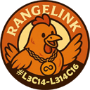

# RangeLink Packages

  

This directory contains the RangeLink monorepo packages. Each package has its own `README` with detailed usage information.

## 📦 Packages

### [`percent-codec-ts/`](./percent-codec-ts)

RFC 3986 plus strict UTF-8 percent codec, used by the text fragment codec for term encoding.

- ✅ Percent encoding and decoding
- ✅ Strict UTF-8 validation with recoverable errors
- ✅ Result-based failures built on the `@couimet/detailed-*` types

**[📖 Percent Codec README](./percent-codec-ts/README.md)**

### [`rangelink-core-ts/`](./rangelink-core-ts)

Pure TypeScript core library — zero dependencies, platform-agnostic.

- ✅ Link generation and parsing
- ✅ Selection analysis (rectangular detection)
- ✅ Configuration validation
- ✅ BYOD (portable links) support

**[📖 Core Library README](./rangelink-core-ts/README.md)** | **[🔧 Development Guide](./rangelink-core-ts/DEVELOPMENT.md)**

### [`rangelink-text-fragment-ts/`](./rangelink-text-fragment-ts)

RangeLink's text fragment policy — a configured facade over `text-fragment-ts`.

- ✅ One import site for the codec and the decision it leaves open
- ✅ Matched, not-found and ambiguous outcomes a caller can act on
- ✅ A case policy with a case-insensitive fallback

**[📖 RangeLink Text Fragment README](./rangelink-text-fragment-ts/README.md)**

### [`rangelink-vscode-extension/`](./rangelink-vscode-extension)

VS Code extension — thin wrapper around the core library.

- ✅ Commands and keyboard shortcuts
- ✅ Configuration integration
- ✅ Status bar feedback
- ✅ Terminal binding (claude-code integration)

**[📖 Extension README](./rangelink-vscode-extension/README.md)** | **[🔧 Development Guide](./rangelink-vscode-extension/DEVELOPMENT.md)**

### [`text-fragment-ts/`](./text-fragment-ts)

Text fragment codec — the browser-standard `:~:text=` grammar, its term matcher, and the fragment types.

- ✅ Fragment directive parsing and formatting
- ✅ Whole-document term matching with browser-faithful defaults
- ✅ A conformance suite ported from web-platform-tests
- ✅ Raw paths in and out; path quoting stays in the core library

**[📖 Text Fragment README](./text-fragment-ts/README.md)** | **[📐 Design Notes](./text-fragment-ts/DESIGN.md)**

---

## 📚 Understanding the Architecture

Want to understand how these packages work together?

- **[Architecture Overview](../docs/ARCHITECTURE.md)** — Design principles, package relationships, and multi-language vision
- **[Development Guide](../DEVELOPMENT.md)** — Monorepo setup, workspace commands, and workflow
- **[Root README](../README.md#monorepo-structure)** — Quick overview of the monorepo structure

---

**💡 Tip:** Each package has its own `DEVELOPMENT.md` with package-specific commands and debugging instructions.
