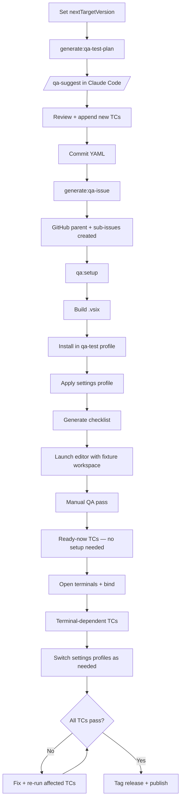
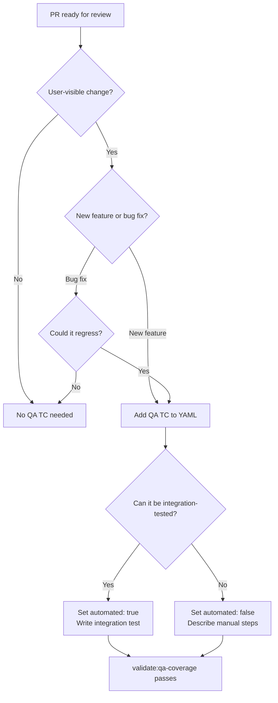

# Testing RangeLink VS Code Extension

> **Note:** This guide covers testing the RangeLink VS Code extension. For development workflow (F5 debugging, local install), see [DEVELOPMENT.md](./DEVELOPMENT.md). For publishing, see [PUBLISHING.md](./PUBLISHING.md).

---

## Quick Reference

| Test type             | Command                      | When to run                        | Runs in CI           |
| --------------------- | ---------------------------- | ---------------------------------- | -------------------- |
| Unit tests            | `pnpm test`                  | Every change                       | ✅                   |
| Unit tests (watch)    | `pnpm test:watch`            | During active development          | —                    |
| Coverage report       | `pnpm test:coverage`         | Before PR / on demand              | ✅ (with thresholds) |
| Integration tests     | `pnpm test:release`          | Before PR, after feature work      | ✅                   |
| Prepare QA test plan  | `pnpm generate:qa-test-plan` | Start of release cycle             | —                    |
| Generate QA issue     | `pnpm generate:qa-issue`     | At the start of each release cycle | —                    |
| Generate QA checklist | `pnpm generate:qa-checklist` | Before manual QA pass              | —                    |
| QA smoke setup        | `pnpm qa:setup`              | Before manual QA pass              | —                    |
| Validate QA coverage  | `pnpm validate:qa-coverage`  | After adding integration tests     | ✅                   |

All commands run from `packages/rangelink-vscode-extension/` unless noted.

---

## Testing Lifecycle

### Release QA Cycle (once per release)



---

## Unit Tests

```bash
# Run all unit tests
pnpm test

# Watch mode — re-runs on file change
pnpm test:watch

# Coverage report (writes to coverage/)
pnpm test:coverage
```

Integration test files (`src/__integration-tests__/`) are excluded from the Jest run — they require the VS Code extension host and are covered by `pnpm test:release`.

---

## Integration Tests (VS Code Extension Host)

### What they cover

Integration tests run inside a real VS Code process via `@vscode/test-cli`. They validate behaviour that cannot be tested with mocks: command registration, clipboard interaction, navigation, document link detection, and terminal binding.

### Running locally

```bash
# From packages/rangelink-vscode-extension/
pnpm test:release
```

### QuickPick limitation

VS Code's extension host test runner provides no API to interact with QuickPick UI — tests cannot programmatically select items, dismiss pickers, or read picker contents. A QuickPick that opens during a test **will stall the test indefinitely** because it blocks the command from completing, and there is no way to dismiss it from test code.

**Workaround — command bypass:** Many TCs that involve a QuickPick as a means to an end (e.g., "bind via picker, verify toast") can be automated by calling the underlying command directly (`rangelink.bindToTerminalHere`, `rangelink.bindToTextEditorHere`) to bypass the picker entirely, then asserting the outcome via log-based UI assertions.

**What cannot be automated:** TCs that verify picker content itself (item ordering, badges, grouping, placeholder text) or dialog interaction (confirmation buttons, cancel behavior) must remain `automated: false` in the QA YAML. These require manual testing.

See https://github.com/couimet/rangeLink/issues/483 for the full triage of automatable vs manual TCs.

---

## CI Pipeline

CI runs automatically on every pull request and on pushes to `main`. The job is defined in `.github/workflows/ci.yml`.

### Job: Test & Validate (`ubuntu-latest`)

Steps run in this order:

| Step                         | What it does                                                                         |
| ---------------------------- | ------------------------------------------------------------------------------------ |
| Setup Node.js and pnpm       | Installs the Node version from `.nvmrc` via the `setup-node-pnpm` composite action   |
| Install dependencies         | Runs `pnpm install` via the `install-deps` composite action                          |
| Check formatting and linting | Runs Prettier and ESLint via `check-formatting`                                      |
| Run tests with coverage      | Runs `pnpm test` (all packages) with coverage thresholds enforced                    |
| Run integration tests        | Runs `pnpm test:release` under Xvfb via the `run-integration-tests` composite action |
| Check TODOs/FIXMEs           | Counts or diffs `TODO`/`FIXME` comments; on PRs, fails if new ones are introduced    |

---

## QA Test Plan

The QA test plan is a version-scoped YAML file that tracks both automated and manual test cases for a given release cycle.

### File location and naming

```text
qa/qa-test-cases-<version>-<YYYY-MM-DD>.yaml
```

Example: `qa/qa-test-cases-v1.1.0-2026-03-13.yaml`

The version is the target release (`nextTargetVersion` from `package.json`) and the date is when the plan was generated. Both are embedded in the filename and parsed automatically by the `generate-qa-issue` script — no extra flags needed.

New QA YAML files are created by `pnpm generate:qa-test-plan`. The script carries forward all TCs from the most recent YAML, resets `status:` fields to `pending`, and preserves `automated:` flags.

### The `automated` field

Each test case has an `automated: true/false` field:

- `automated: true` — covered by an integration test in `src/__integration-tests__/`. These run on every CI push and do not require manual execution during a release cycle.
- `automated: false` — must be executed manually. Reasons include: requires AI assistant interaction, requires UI interaction (e.g. modal dialogs, drag-and-drop), or tests platform-specific behaviour that differs from the CI environment.

When you implement an integration test for a TC, update its `automated` field to `true` in the YAML.

### When to add new test cases

Add at least one TC to the QA YAML for every:

- New user-visible feature
- Bug fix that should not regress



Place new TCs at the end of the file under the relevant feature section. TC ID rules:

- **Never renumber** existing IDs — results reference IDs by name across QA cycles
- **Continue from the highest** existing ID for that feature slug (e.g., if `bind-to-destination-010` exists, the next is `bind-to-destination-011`)
- **IDs are globally unique** per feature slug across all QA YAML snapshots — check the highest ID in `qa/` before assigning

Set `automated: true` immediately if you are also writing the integration test; otherwise set `false` and leave a note in the scenario description.

### Starting a new QA cycle

1. Set `nextTargetVersion` in `packages/rangelink-vscode-extension/package.json` to the upcoming release version
2. Run `pnpm generate:qa-test-plan:vscode-extension` from the root of the project to create the new YAML with all existing TCs reset to `pending`
3. Run `/qa-suggest` in Claude Code — it creates a scratchpad with suggested TCs and a YAML block ready to append
4. Review the scratchpad, edit/remove TCs as needed, then append the YAML block to the QA file
5. Commit the YAML and run `pnpm generate:qa-issue:vscode-extension` from the root of the project to create the GitHub tracking issues (auto-discovers the latest QA YAML)
6. Run `pnpm qa:setup:vscode-extension` to build the extension, install into an isolated `qa-test` profile, generate a QA checklist, and launch the editor with the fixture workspace

### Running a QA pass

The QA smoke setup script automates the repetitive environment setup for manual testing:

```bash
pnpm qa:setup:vscode-extension
```

This builds the extension, installs it into an isolated `qa-test` VS Code/Cursor profile, copies the selected settings profile into the fixture workspace, generates a date-stamped QA checklist, and launches the editor.

**Fixture workspace:** `qa/fixtures/workspace/` contains pre-built files covering all TC preconditions (TypeScript, TSX, markdown with embedded links, nested paths, paths with spaces, path-format reference file).

**Settings profiles:** `qa/fixtures/settings/` contains pre-built configurations for different TC groups. Switch between them with the `--settings` flag:

```bash
pnpm qa:setup:vscode-extension -- --settings clipboard-never
pnpm qa:setup:vscode-extension -- --settings custom-delimiters
pnpm qa:setup:vscode-extension -- --list-profiles          # show all available profiles
```

**QA checklist:** Generated at `qa/qa-checklist-v<version>-<date>.txt`. Groups TCs by feature area, tags readiness state and required settings profiles, and marks automated TCs. The checklist can also be generated standalone:

```bash
pnpm generate:qa-checklist:vscode-extension
```

### Generating a QA GitHub issue

The `generate-qa-issue` script creates a parent GitHub issue + one sub-issue per feature section, linked with task-list checkboxes. This is the starting point for a manual QA cycle.

**Prerequisites:**

```bash
# python3 with PyYAML (the script shells out to python3 for YAML parsing)
# If pip3 install fails on system Python, use a venv:
python3 -m venv .venv && source .venv/bin/activate
python3 -m pip install pyyaml

# gh CLI authenticated with write access
gh auth status
```

**Running the script (from the root of the project):**

```bash
# Auto-discover latest YAML — prompts for confirmation
pnpm generate:qa-issue:vscode-extension

# Dry run — prints what would be created without making API calls
pnpm generate:qa-issue:vscode-extension -- --dry-run

# Explicit file — skips auto-discover prompt
pnpm generate:qa-issue:vscode-extension -- qa/qa-test-cases-v1.1.0-2026-03-14.yaml
```

The script creates:

1. One **parent issue** titled `QA: <version> — <date>` with a task list of sub-issue links
2. One **sub-issue per feature section** listing all TCs (automated ones marked for reference)

Sub-issues are linked to the parent via GitHub's sub-issue API. Run with `--dry-run` first to verify the output before committing API calls.
