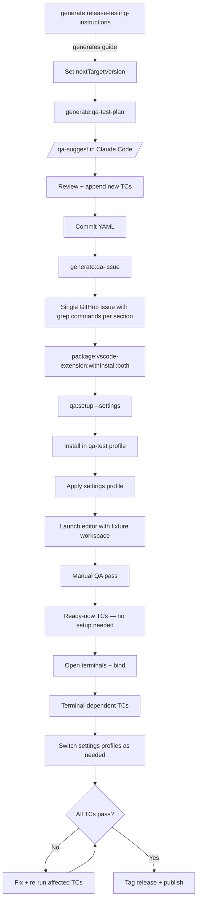
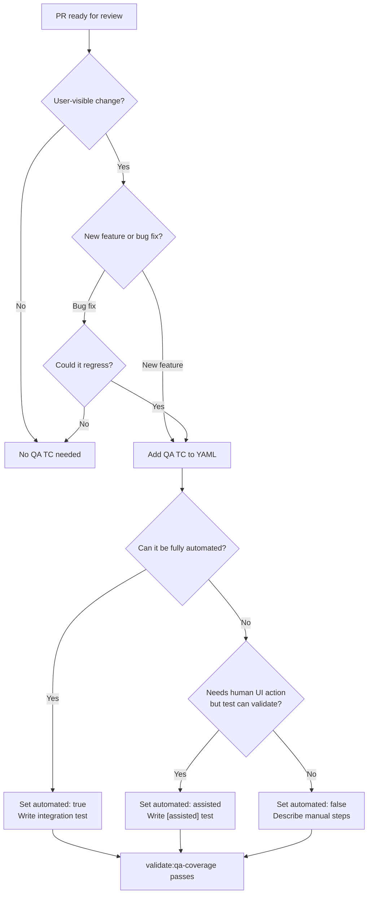

# Testing RangeLink VS Code Extension

> **Note:** This guide covers testing the RangeLink VS Code extension. For development workflow (F5 debugging, local install), see [DEVELOPMENT.md](./DEVELOPMENT.md). For publishing, see [PUBLISHING.md](./PUBLISHING.md).

---

## Quick Reference

| Test type                | Command                                                       | When to run                                                                               | Runs in CI           |
| ------------------------ | ------------------------------------------------------------- | ----------------------------------------------------------------------------------------- | -------------------- |
| Unit tests               | `pnpm test`                                                   | Every change                                                                              | ✅                   |
| Unit tests (watch)       | `pnpm test:watch` (from extension dir)                        | During active development                                                                 | —                    |
| Coverage report          | `pnpm test:coverage` (from extension dir)                     | Before PR / on demand                                                                     | ✅ (with thresholds) |
| Integration tests        | `pnpm test:release`                                           | Before PR, after feature work                                                             | —                    |
| Integration (CI-safe)    | `pnpm test:release:automated`                                 | CI / headless environments                                                                | ✅                   |
| Integration (extensions) | `pnpm test:release:with-extensions`                           | Tests needing real AI extensions                                                          | ✅                   |
| Integration (filter)     | `pnpm test:release:grep "<pattern>"`                          | Run specific TCs by ID or suite                                                           | —                    |
| Prepare QA test plan     | `pnpm generate:qa-test-plan:vscode-extension`                 | Start of release cycle                                                                    | —                    |
| Generate QA issue        | `pnpm generate:qa-issue:vscode-extension`                     | At the start of each release cycle                                                        | —                    |
| Local QA checklist       | `pnpm generate:qa-issue:vscode-extension -- --local`          | Offline QA / before manual pass                                                           | —                    |
| QA smoke setup           | `pnpm qa:setup:vscode-extension`                              | Before manual QA pass (build first with `pnpm package:vscode-extension:withInstall:both`) | —                    |
| Validate QA coverage     | `pnpm validate:qa-coverage:vscode-extension`                  | After adding integration tests                                                            | ✅                   |
| Release testing guide    | `pnpm generate:release-testing-instructions:vscode-extension` | Start of release cycle                                                                    | —                    |
| Verify all QA scripts    | `pnpm verify:qa-scripts:vscode-extension`                     | After QA script changes                                                                   | —                    |

All commands run from the project root unless noted.

All `test:release*` commands accept `--label <tag>` (filter by QA YAML label), `--assisted` (limit to `automated: assisted` TCs), and `--no-assisted` (limit to `automated: true` TCs). See [Label-based filtering](#label-based-filtering-with---label) below.

---

## Testing Lifecycle

### Release QA Cycle (once per release)



---

## Integration Tests (VS Code Extension Host)

> **Note:** Integration test files (`src/__integration-tests__/`) are excluded from the Jest unit test run — they require the VS Code extension host and are covered by `pnpm test:release`.

### What they cover

Integration tests run inside a real VS Code process via `@vscode/test-cli`. They validate behaviour that cannot be tested with mocks: command registration, clipboard interaction, navigation, document link detection, and terminal binding.

### Running locally

```bash
# From packages/rangelink-vscode-extension/
pnpm test:release
```

### QuickPick and InputBox dismissal

VS Code's extension host test runner provides no API to programmatically select QuickPick items or interact with dialogs. However, `workbench.action.closeQuickOpen` can programmatically dismiss QuickPicks and InputBoxes — meaning tests that open a picker, read its logged content, and dismiss it **can now be fully automated**.

**`openAndDismiss` helper:** The pattern for automated picker-open-and-dismiss is encapsulated in `openAndDismiss(command)`:

```typescript
// Fires the command (which opens a QuickPick), waits for render + log emission,
// dismisses with closeQuickOpen, then settles.
await openAndDismiss(CMD_BIND_TO_DESTINATION);
const items = extractQuickPickItemsLogged(logCapture.getLinesSince('before-test'));
// assert on items as usual
```

**Workaround — command bypass:** TCs that use a picker as a means to an end (e.g., "bind via picker, verify toast") can be automated by calling the underlying command directly (`rangelink.bindToTerminalHere`, `rangelink.bindToTextEditorHere`) to bypass the picker entirely.

**What still requires assisted mode:** TCs that need to:

- Select a specific item from a picker (closeQuickOpen only dismisses, it cannot choose)
- Navigate a multi-picker flow (select item in picker A → picker B opens → verify B's content)
- Verify dialog interactions (confirmation buttons with Yes/No)

Mark these `automated: assisted` in the QA YAML. See [Assisted mode](#assisted-mode-assisted-tests) below. Only TCs that genuinely cannot be tested even with human-in-the-loop assistance should remain `automated: false`.

See https://github.com/couimet/rangeLink/issues/483 for the full triage of automatable vs manual TCs.

### Assisted mode (`[assisted]` tests)

Tests tagged `[assisted]` in their name automate setup and validation but pause for a human to perform UI actions that the extension host cannot control (QuickPick interaction, dialog buttons, visual verification). A persistent VS Code notification shows the instruction text; the tester clicks Cancel to signal completion and resume the test.

**Two scripts, two modes:**

| Script                        | What runs                            | Timeout    | Use case                      |
| ----------------------------- | ------------------------------------ | ---------- | ----------------------------- |
| `pnpm test:release`           | All tests (automated + `[assisted]`) | 5 min/test | Human at screen — QA sessions |
| `pnpm test:release:automated` | Automated only (skips `[assisted]`)  | 20 s/test  | CI / headless environments    |

All three scripts are handled by a single `scripts/test-release-run.sh` with different flags. The automated config (`.vscode-test.automated.mjs`) uses `grep: '\\[assisted\\]'` with `invert: true` to skip assisted tests.

**Filtering with `test:release:grep`:**

```bash
# Single TC by ID
pnpm test:release:grep "status-bar-menu-002"

# Multiple TCs (regex OR)
pnpm test:release:grep "status-bar-menu-002|status-bar-menu-005"

# All TCs in a suite (matches suite name)
pnpm test:release:grep "R-M Status Bar Menu"

# Only [assisted] tests
pnpm test:release:grep "\[assisted\]"
```

Runs from the project root or extension directory. Compiles first, then runs only matching tests. The `validate:qa-coverage` step is intentionally skipped when filtering — it expects the full suite.

**Output capture and failed-test rerun:**

All `test:release*` commands capture output to timestamped files in `qa/output/` (e.g., `qa/output/test-run-20260328-141328-grep-assisted-file-picker.txt`). The report file path is printed at the start and end of each run. Output streams incrementally — partial reports are preserved if the run is interrupted.

When tests fail, the script extracts failed TC IDs and prints a ready-to-use rerun command:

```text
Re-run failed tests:
  pnpm test:release:grep "file-picker-002|file-picker-003"
```

### Label-based filtering with `--label`

The `--label` flag resolves test IDs from QA YAML labels and builds a Mocha grep pattern. Labels in the YAML are multi-line lists under each test case:

```yaml
- id: clipboard-preservation-001
  labels:
    - clipboard
  automated: true
```

Common flag combinations:

```bash
# All tests with a given label (any automated status — true, assisted, or false)
pnpm test:release --label clipboard

# Label + assisted-only (human-in-the-loop tests only)
pnpm test:release --label clipboard --assisted

# Label + exclude assisted (CI-safe, automated: true tests only)
pnpm test:release --label clipboard --no-assisted

# Label + assisted + real AI extensions (e.g., Claude Code)
pnpm test:release:with-extensions --label clipboard --assisted

# Label combined with an explicit --grep pattern
pnpm test:release:grep "cold-paste" --label clipboard --assisted
```

When `--assisted` is passed, only TCs marked `automated: assisted` are included. When `--no-assisted` is passed, only TCs marked `automated: true` are included. Without either, all matching TCs run regardless of their `automated` status.

`--label` resolves from the latest QA YAML in `qa/`. It combines with `--with-extensions` and `--grep` — the label IDs are appended to any existing grep pattern via OR (`|`). The `validate:qa-coverage` step is skipped when filtering (same as `--grep` filtering), since it expects the full suite.

**Adding new assisted tests:**

1. Add the test to the relevant themed file in `src/__integration-tests__/suite/` — do not create a separate directory.
2. Prefix the test name with `[assisted]`: `test('[assisted] my-tc-id: description', ...)`.
3. Call `printAssistedBanner()` in `suiteSetup()` if this is the first `[assisted]` test in the suite.
4. Use `waitForHuman(tcId, action, consoleSteps, notificationSummary)` to pause for human input.
5. Add assertions after `waitForHuman` returns (log-based, clipboard, etc.).
6. Clean up in `teardown`/`suiteTeardown` — close editors, dispose terminals, delete temp files.

**Two-screen workflow:** Run `pnpm test:release` in a terminal on one screen. The VS Code test host opens on the other. Instructions appear in both the terminal (structured steps) and as a persistent notification in VS Code (flowing summary). Perform the action, click Cancel on the notification, and the test continues.

---

## CI Pipeline

CI runs automatically on every pull request and on pushes to `main`. The job is defined in `.github/workflows/ci.yml`.

### Job: Test & Validate (`ubuntu-latest`)

Steps run in this order:

| Step                         | What it does                                                                                   |
| ---------------------------- | ---------------------------------------------------------------------------------------------- |
| Setup Node.js and pnpm       | Installs the Node version from `.nvmrc` via the `setup-node-pnpm` composite action             |
| Install dependencies         | Runs `pnpm install` via the `install-deps` composite action                                    |
| Check formatting and linting | Runs Prettier and ESLint via `check-formatting`                                                |
| Run tests with coverage      | Runs `pnpm test` (all packages) with coverage thresholds enforced                              |
| Run integration tests        | Runs `pnpm test:release:automated` under Xvfb via the `run-integration-tests` composite action |
| Check TODOs/FIXMEs           | Counts or diffs `TODO`/`FIXME` comments; on PRs, fails if new ones are introduced              |

---

## QA Test Plan

The QA test plan is a version-scoped YAML file that tracks both automated and manual test cases for a given release cycle.

### File location and naming

```text
qa/qa-test-cases-v<version>.yaml
```

Example: `qa/qa-test-cases-v1.1.0.yaml`

The version is the target release (`nextTargetVersion` from `package.json`). It is embedded in the filename and parsed automatically by the `generate-qa-issue` script — no extra flags needed. One file per release — Git tracks history across versions.

New QA YAML files are created by `pnpm generate:qa-test-plan`. The script carries forward all TCs from the most recent YAML, resets `status:` fields to `pending`, and preserves `automated:` flags.

### The `automated` field

Each test case has an `automated` field with three possible values:

| Value      | Meaning                                                | Covered by                                  | Runs in CI |
| ---------- | ------------------------------------------------------ | ------------------------------------------- | ---------- |
| `true`     | Fully automated, no human needed                       | `test:release:automated` and `test:release` | Yes        |
| `assisted` | Automated setup + validation, human performs UI action | `test:release` only (human at screen)       | No         |
| `false`    | Fully manual, no integration test exists               | Manual QA checklist                         | No         |

- `automated: true` — covered by a non-`[assisted]` integration test in `src/__integration-tests__/suite/`. Runs on every CI push.
- `automated: assisted` — covered by an `[assisted]`-tagged integration test. The test automates setup and validation but pauses for a human to perform a UI action (QuickPick verification, dialog interaction). See [Assisted mode](#assisted-mode-assisted-tests) above.
- `automated: false` — must be executed manually. Reasons include: requires AI assistant interaction, requires platform-specific behaviour, or cannot be tested even with human-in-the-loop assistance.

When you implement an integration test for a TC, update its `automated` field to `true` or `assisted` in the YAML.

### When to add new test cases

Add at least one TC to the QA YAML for every:

- New user-visible feature
- Bug fix that should not regress



Place new TCs at the end of the file under the relevant feature section. TC ID rules:

- **Never renumber** existing IDs — results reference IDs by name across QA cycles
- **Continue from the highest** existing ID for that feature slug (e.g., if `bind-to-destination-010` exists, the next is `bind-to-destination-011`)
- **IDs are globally unique** per feature slug across all QA YAML snapshots — check the highest ID in `qa/` before assigning

Set `automated: true` immediately if you are also writing the integration test; otherwise set `false` and leave a note in the scenario description.

### Quick Start

Release testing is **guided through a script** that generates version-specific instructions:

```bash
pnpm generate:release-testing-instructions:vscode-extension
```

The script validates prerequisites and generates a markdown file at `qa/release-testing-instructions-v<version>.md` with copy-paste-ready commands for the full release testing lifecycle (7 phases: prerequisites → QA test plan → GitHub issues → unit tests → integration tests → manual QA → pre-publish verification).
